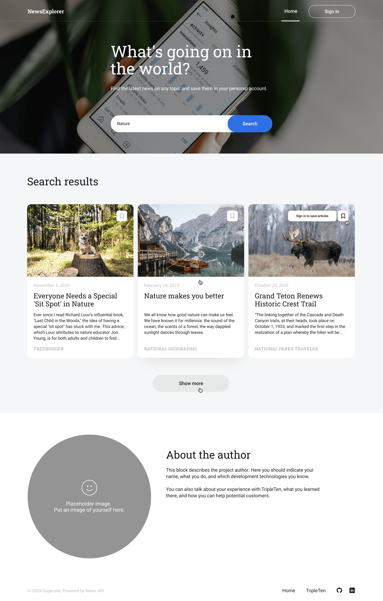
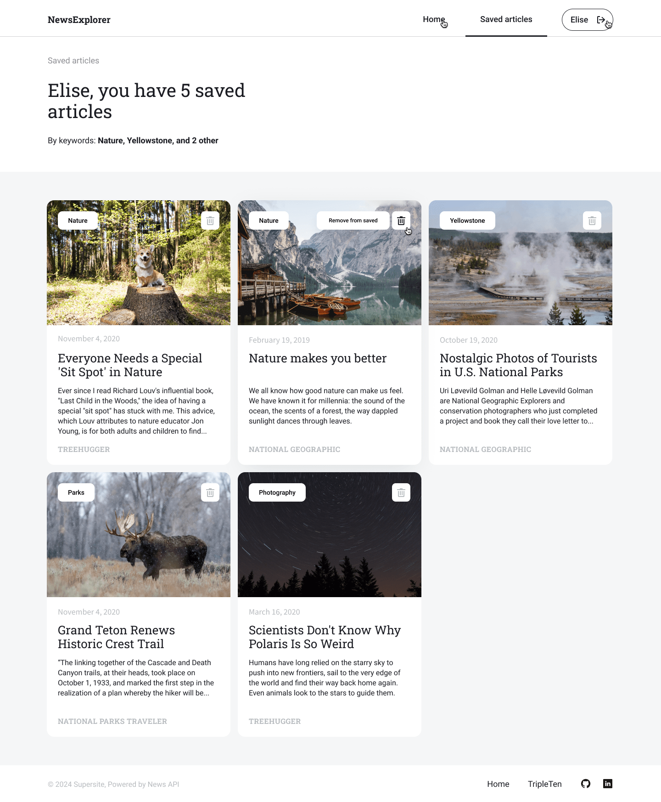

# News Explorer

## About the project

https://newsapi.org/docs

### About News Explorer...

- [Figma design](https://www.figma.com/design/3ottwMEhlBt95Dbn8dw1NH/Your-Final-Project?node-id=22618-1012&t=2VvlmAPvt3527zuo-0)

## Table of contents

## Screenshots

### Headers (Mobile & Desktop)

  

    
<strong>Mobile Header</strong>

    
  

  

    
<strong>Desktop Header</strong>

    
  

### Saved Articles (Desktop)

  

